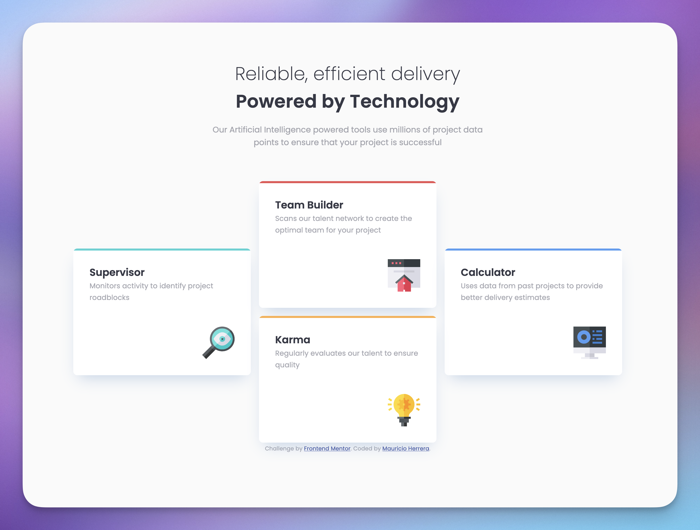

# Frontend Mentor - Four card feature section solution

This is a solution to the [Four card feature section challenge on Frontend Mentor](https://www.frontendmentor.io/challenges/four-card-feature-section-weK1eFYK). Frontend Mentor challenges help you improve your coding skills by building realistic projects. 

## Table of contents

- [Overview](#overview)
  - [The challenge](#the-challenge)
  - [Screenshot](#screenshot)
  - [Links](#links)
- [My process](#my-process)
  - [Built with](#built-with)
  - [What I learned](#what-i-learned)
  - [Continued development](#continued-development)
  - [Useful resources](#useful-resources)
- [Author](#author)
- [Acknowledgments](#acknowledgments)

**Note: Delete this note and update the table of contents based on what sections you keep.**

## Overview

### The challenge

Users should be able to:

- View the optimal layout for the site depending on their device's screen size

### Screenshot

## Links

- Solution URL: [GitHub](https://newspaceracer.github.io/probable-octo-robot/)

## My process

### Built with

- Semantic HTML5 markup
- CSS custom properties
- Flexbox
- CSS Grid
- Mobile-first workflow

### What I learned

- Hardest part was getting the cards on the desktop layout. I had to use grid and it was a bit tricky to get the cards in the right place. I was trying to use flex and it wasnt working mostly because of the margin-top of the side cards. Then i pivoted to grid and it worked better, specially when you limit that view to a desktop media query. and you keep it flex simple on mobile. 

- position: relative; for .card Creates a positioning context for absolute children (::before). At first i thought it would position the card relative to its own parent but actually relative means that the element stays in normal flow but you can add properties to it like top, left, right, bottom and then it will move. It also adds position context for absolute children which is what we wanted in this case to add the color bar on top of the card. 

### Continued development

- I want to learn how to think more in a CUBE CSS approach.
- I need to keep practicing with CSS Grid and responsive layouts.
- I want to give tailwind a try.

## Author

- Website - [Mauricio Herrera](https://herrera.wiki)
